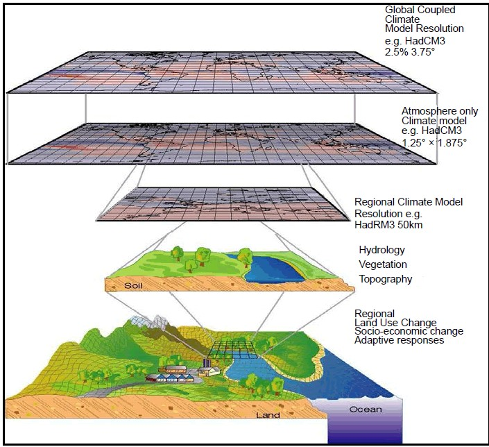

## What is Climate Downscaling?

- A process of generating higher-resolution data (or climate change information) from the relatively coarse-resolution GCMs.
- Generally, there are two main strategies for downscaling:
  - **Statistical Downscaling**: Establishing a statistical relationship between local observational data and large-scale (global) variables.
  - **Dynamical Downscaling**: Dynamical extrapolation of the effects of large-scale climate processes to regional or local scales.

### Statistical Downscaling

Statistical downscaling involves relating the large-scale climate state to the local-scale target variables (e.g. precipitation, temperature, and humidity) using a ***transfer function***, such as regression or weather generators. 

### Dynamical Downscaling 

Dynamical downscaling is carried out by nesting a fine-scale climate model in a coarse-scale global model

