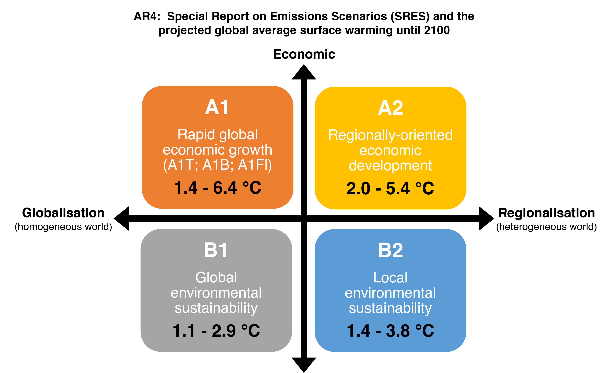

## What are Climate Change Scenarios?

<b>Summary</b>

- Climate change scenarios are a powerful tool for understanding climate change, charting response strategies, and supporting climate policy making.

- Climate change scenarios are not about predicting the future, but come in the form of projections of what can happen or pathways of how to reach certain goals.

- Climate change scenarios are usually used in pairs or larger sets which determine their context and meaning.

- Climate change scenarios are not predictions of the future, but rather projections of what can happen to the future climate.
- The different scenarios are derived from different **pathways** towards certain goals.

- A single scenario is virtually meaningless. Scenarios are rather used in pairs or larger sets to contrast different futures and choices. For example, scenario-driven climate policy analysis relies on comparing a projection without policy intervention (typically called baseline scenario) with a pathway towards a desired goal (e.g., the 2 °C goal). Scenarios are hence fundamentally context dependent. Understanding a single scenario requires understanding the set of scenarios it is embedded in.

- Climate change is not happening in isolation, but in concert with other processes of environmental, social, technical, economic, and cultural change. Scenario types have emerged that embed climate change in this broader context of change.
---
- These climate change scenarios have always been, and still are, defined by the **Intergovernmental Panel of Climate Change (IPCC)**.
- The IPCC is an United Nations body for assessing the science related to climate change. It was established in 1988 by the **World Meteorological Organization (WMO)** and the **United Nations Environment Programme (UNEP)**.
- IPCC's Assessment Reports (AR) aims to **provide recommendations, based on current research, to governments, policymakers, and the public**.
> "Certain human activities could change global climate patterns, threatening present and future generations with potentially severe economic and social consequences", and that "Continued growth in atmospheric concentrations of 'greenhouse' gases could produce global warming with an eventual rise in sea levels, the effects of which could be disastrous for mankind if timely steps are not taken at all levels" -- **The United Nations (1988)**

---

## Previous assessment scenarios
- As of 2022, there has been 6 ARs
  - AR1 - 1990
  - SAR - 1996
  - TAR - 2001
  - AR4 - 2007
  - AR5 - 2013
  - AR6 - 2022

--- 
### AR1 (1990)
- Scenario A (Business-as-usual)
  - Coal-intensive energy supply
  - Higher emissions (10-20%) of carbon dioxide and methane by 2025
  - Global mean temperature would increase by about 0.3 °C per decade during the 21st century.
  - High deforestation
  - Agricultural practices are uncontrolled

- Scenario B  
  - Lower carbon fuels
  - Deforestation is reversed

- Scenario C
    -Shift towards renewables and nuclear energy in the second half of 21st century
    - Control CFC and agricultural emissions

- Scenario D
  - Shift to renewables and nuclear in the first half of the next century
---

### SAR (1992) : "Second Assessment Report"

---
### TAR (2001) : "Third Assessment Report"
- A1 Scenario family
  - Very rapid economic growth
  - Global population peaks in mid-century and decreases
  - Rapid growth of modern technologies
  - Improve better relationship among regions by reducing the difference in per capita income
    - A1B: A balance across all energy sources
    - A1FI: Fossil intensive energy
    - A1T: Non-fossil energy sources
- A2 scenario
  - Very heterogeneous world
  - Maintain self-reliance and preservation of local identities continuously increasing population
  - Economic and technological developments are regional and slow

- B1 Scenario
  - Global population peaks in mid-century and decreases
  - Rapid change in economic structures toward a service and information economy
  - Reductions in material intensity
  - Introduction of clean and resource-efficient technologies
  - Economic, social and environmental sustainability, including improved equity without additional climate initiatives
  - 
- B2 scenario
  - Local solutions to economic, social and environmental sustainability
  - Continuously increasing global population, at a rate lower than A2
  - Intermediate levels of economic development
  - Less rapid and more diverse technological change than A1 and B1
  

---

### AR4 (2007) 
- The driving forces considered in defining the scenarios in AR4 are:
  - Population
  - Economy
  - Technology
  - Energy
  - Land use

---

### AR5 (2013) 
- The climate projections in AR5 are based on "Representative Concentration Pathways" (RCPs).
- The RCPs are consistent with a wide range of possible changes in future anthropogenic greenhouse gas emissions.

---

## Current assessment scenarios: Shared Socioeconomic Pathways (SSPs)  

<b>Summary</b>

- Socioeconomic scenarios provide a consistent set of assumptions about societal, technical, cultural and economic developments over the 21st century.
  
- They typically center around a general narrative about the world’s future augmented by projections of factors like population, economic activity, and urbanization.
  
- Socioeconomic scenarios in climate change research are increasingly based on the Shared Socioeconomic Pathways (SSPs) which represent five different futures with widely varying challenges to mitigation and adaptation.

- SSPs are scenarios of projected socioeconomic global changes up to 2100.
- They are used to derive greenhouse gas emissions scenarios with different climate policies.
- The SSPs offer a systematic exploration of possible socioeconomic futures in terms of widely different predispositions to mitigate and adapt to climate change.

---

<b>SSP 1: Sustainability - Taking the green road</b>

- This future poses **low challenges to mitigation and low challenges to adaptation**
- Global population peaks mid-century
- Emphasis on human well-being
- Environmentally friendly technologies and renewable energy
- Strong and flexible institutions on global, regional, and national level

---

<b>SSP 2: Middle of the road</b>

- This future poses **moderate challenges to mitigation and moderate challenges to adaptation**
- Population growth stabilizes toward the end of the century
- Current social, economic, and technological trends continue
- Global and national institutions make slow progress toward achieving sustainable development goals

---

<b>SSP 3: Regional rivalry - A rocky road</b>

- This future poses **high challenges to mitigation and high challenges to adaptation**
- Population growth continues with high growth in developing countries
- Emphasis on national issues due to regional conflicts and nationalism
- Economical development is slow and fossil fuel dependent
- Weak global institutions and little international trade

---

<b>SSP 4: Inequality - A road divided</b>

- This future poses **low challenges to mitigation and high challenges to adaptation**
- Population growth stabilizes toward the end of the century
- Growing divide between globally-connected, well educated society and fragmented lower income societies
- Unrest and conflict becomes more common
- Global, regional, and national institutions are ineffective

---

<b>SSP 5: Fossil-fueled development - Taking the highway</b>

- This future poses **high challenges to mitigation and low challenges to adaptation**
- Global population peaks mid-century
- Emphasis on economic growth and technological progress
- Global adoption of resource and energy intensive lifestyles
-Lack of environmental awareness

