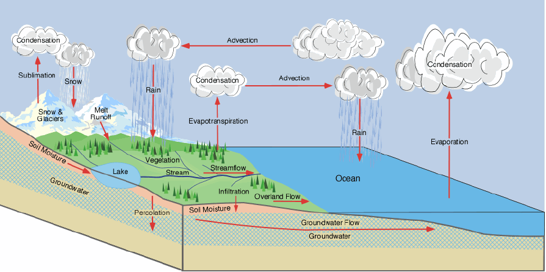

# Hydrological Cycle

- The hydrological cycle is a conceptual model that describes the storage and movement of water between the biosphere, atmosphere, lithosphere, and the hydrosphere.

- At its core, the water cycle is the motion of the water from the ground to the atmosphere and back again. Of the many processes involved in the hydrologic cycle, the most important are:
  - evaporation
  - transpiration
  - condensation
  - precipitation
  - runoff

- The water cycle is driven primarily by the energy from the Sun.
- It is essentiallyt a **closed system**.
- Water cycle does 2 things: (i) redistributes water aroundthe Earth, and (ii) absorbs and redistributes solar energy between locations.

##### Evaporation
Evaporation is the change of state in a substance from a liquid to a gas. In meteorology, the substance we are concerned about the most is water.

For evaporation to take place, energy is required. The energy can come from any source: the sun, the atmosphere, the earth, or objects on the earth such as humans.

##### Transpiration
Transpiration is the evaporation of water from plants through stomata. Stomata are small openings found on the underside of leaves that are connected to vascular plant tissues. In most plants, transpiration is a passive process largely controlled by the humidity of the atmosphere and the moisture content of the soil. Of the transpired water passing through a plant only 1% is used in the growth process of the plant. The remaining 99% is passed into the atmosphere.

##### Condensation
Condensation is the process whereby water vapor in the atmosphere is changed into a liquid state. In the atmosphere condensation may appear as clouds or dew. Condensation is the process whereby water appears on the side of an uninsulated cold drink can or bottle.

Condensation is not a matter of one particular temperature but of a difference between two temperatures; the air temperature and the dewpoint temperature. At its basic meaning, the dew point is the temperature where dew can form.

##### Precipitation
Precipitation is the result when the tiny condensation particles grow too large, through collision and coalescence, for the rising air to support, and thus fall to the earth. Precipitation can be in the form of rain, hail, snow or sleet.

Precipitation is the primary way we receive fresh water on earth. On average, the world receives about 38½" (980 mm) each year over both the oceans and land masses.

##### Runoff
Runoff occurs when there is excessive precipitation and the ground is saturated (cannot absorb any more water). Rivers and lakes are results of runoff. There is some evaporation from runoff into the atmosphere but for the most part water in rivers and lakes returns to the oceans.

If runoff water flows into the lake only (with no outlet for water to flow out of the lake), then evaporation is the only means for water to return to the atmosphere. As water evaporates, impurities or salts are left behind. The result is the lake becomes salty as in the case of the Great Salt Lake in Utah or Dead Sea in Israel.

Evaporation of this runoff into the atmosphere begins the hydrologic cycle over again. Some of the water percolates into the soil and into the ground water only to be drawn into plants again for transpiration to take place.