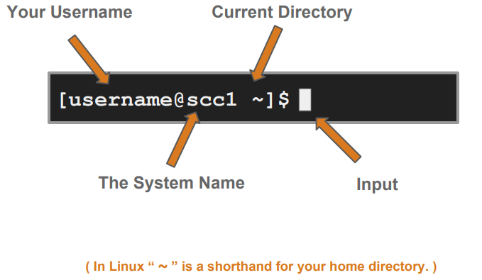

## What is Linux?

Just like Windows, iOS, and Mac OS, Linux is an operating system. In fact, one of the most popular platforms on the planet, Android, is powered by the Linux operating system. 

An operating system is software that manages all of the hardware resources associated with your desktop or laptop. To put it simply, the operating system manages the communication between your software and your hardware. Without the operating system (OS), the software wouldn’t function.


## Linux: Pros and Cons
| Pros                              | Cons                                          |
|-----------------------------------|-----------------------------------------------|
| Free and open-source              | Far too many different distributions          |
| Portable to any hardware platform | Not user friendly and confusing for beginners |
| Made to keep on running           | Is an open-source product trustworthy?        |
| Secure and versatile              |                                               |
| Scalable                          |                                               |
---
## Interaction with Linux
### The Shell
- Program that **interprets commands** and sends them to the OS
- Provides:
  - Built-in commands
  - Programming control structures
  - Environment vaiables
- Linux supports multiple shells such as **bash** ("**B**ourne-**a**gain **Sh**ell"), **csh** ("**C** **Sh**ell"), **tcsh** ("**T**ENEX **C** **Sh**ell"), and etc.

<div align=center>

<figcaption>An example of a Linux command window. Here it shows that the machine is running Ubuntu 20.4 OS, with a BASH shell.</figcaption>
</div>

---

### The "prompt"
<div align=center>

</div>

---
### Command Basics
<div align=center>

</div>

---

### Commands: Hands-On
Once you have opened a Linux Command window, here are some commands you can try.
```console
username@system_name:~$ whoami  #my login
username@system_name:~$ hostname  #name of this computer
username@system_name:~$ echo "Hello, world!"  #print characters to screeen
username@system_name:~$ echo $HOME  #print environment variable
username@system_name:~$ echo my login is $(whoami)  #preplace $(xx) with program output
username@system_name:~$ date  #print currnt time/date
username@system_name:~$ cal #print this month-s calendar
username@system_name:~$ peekabop  #bad command/does not exist

```
<div align=center>

<figcaption>An example of outputs from the commands above.</figcaption>
</div>

