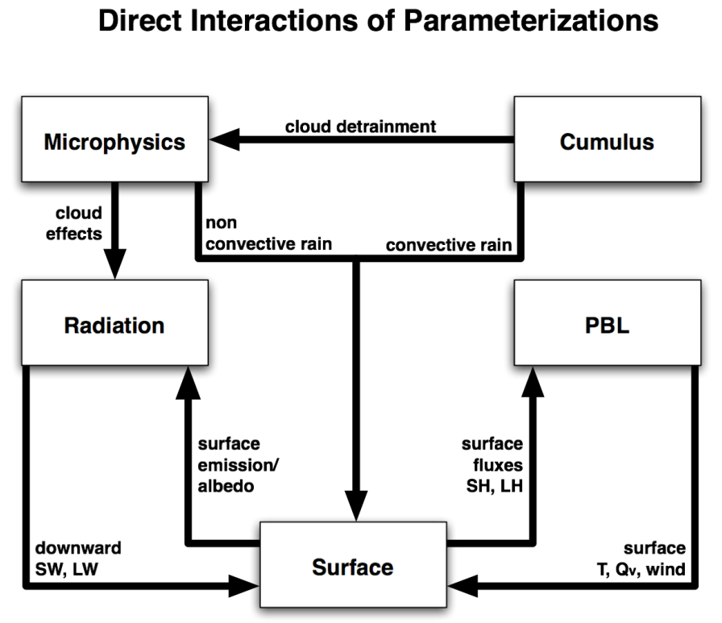
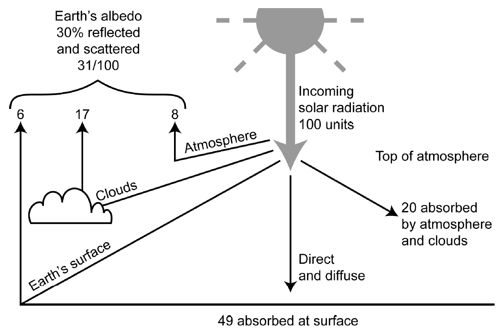
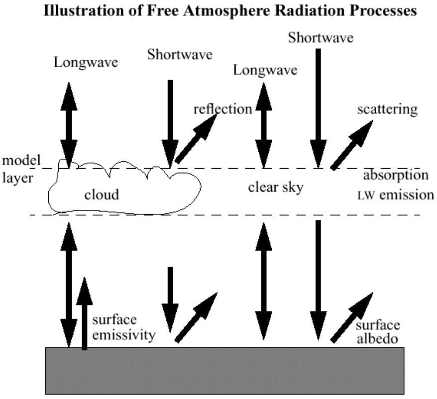
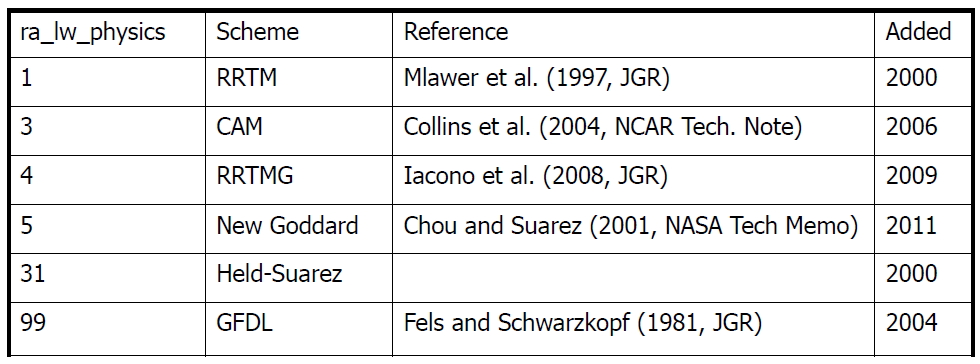

## WRF Physics
In order to simulate real weather and to run simulations with coarse resolutions, a minimum set of physics components is required:
- Radiation
  - Longwave (ra_lw_physics)
  - Shortwave (ra_sw_physics)
- Surface
  - Surface layer (sf_sfclay_physics)
  - Land/water surface (sf_surface_physics)
- Planetary Boundary Layer (PBL) (bl_pbl_physics)
- Turbulence/Diffusion (diff_opt, km_opt)
- Cumulus parameterization (cu_physics)
- Microphysics (mp_physics)

<figcaption></figcaption>

---

## Parameterizations

### Radiation
- Shortwave (solar) - use astronomical equations to calculate the Sun's position as a function of time of day and day of year.

<figcaption></figcaption>

---

<figcaption></figcaption>

#### **WRF Longwave Radiation Schemes (ra_lw_physics)**

- Compute clear sky and cloud upward and downward radiation fluxes
    - Consider infrared (IR) emission from layers 
    - Surface emissivity based on land type
    - Flux divergence leads to cooling in a layer
    - Downward flux at surface important in land energy budget
    - IR radiation generally leads to cooling in clear air (~2K/day), stronger cooling at cloud tops and warming at cloud base

<figcaption></figcaption>

---
#### **Clear Sky: IR-active gases**
- H2O from model prognostic vapor
- CO2 well mixed, specified constant in whole atmosphere (CAM has
yearly values)
  - For CAM, RRTM and RRTMG, GHG input file can update CO2, N2O and CH4
- O3 schemes have own climatologies
  - CAM has monthly, zonal, pressure level data and RRTMG has this as an option
  - Others use single profiles (Goddard has 5 profiles to choose from)

#### **Clouds**
- All schemes interact with resolved model cloud fields allowing for ice and
water clouds and precipitating species
    - Some microphysics options pass own particle sizes to RRTMG radiation: other
combinations only use mass info and assume effective sizes
- Clouds strongly affect IR at all wavelengths (considered “grey bodies”) and
are almost opaque to it.

#### **Cloud Fractions**
- Schemes are capable of handling cloud fractions
- WRF can provide cloud fractions based on RH, but mostly the fraction is 0 or 1 in a grid box
- Cloud fraction methods:
  - cldfra2 used by CAM and RRTMG
  - cldfra used by others except GFDL (computes its own)
- Overlap assumptions needed with multiple layers of varying fraction
  - Random overlap
  - Maximum overlap (clouds stacked as much as possible)
  - Maximum random overlap (maximum for neighboring cloudy layers, random for
layers separated by clear air)
- Different WRF schemes may use different cloud overlapping assumption.
  - For example, RRTMG, CAM use max random overlap

---

#### **Scheme selection**
- Depends on the season of interest
- Depends on the regional climate
- Consider a tried-and-trusted schemes first
  - Similar studies
  - User Guide

#### **Further information**
- https://www2.mmm.ucar.edu/wrf/users/physics/phys_references.html